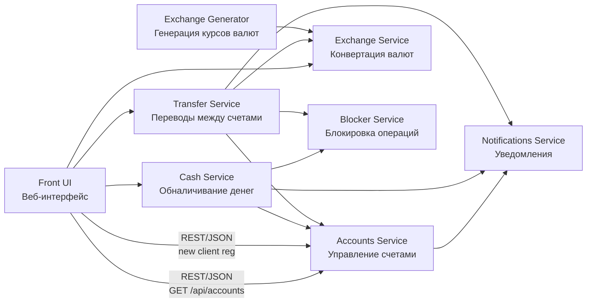

API Gateway	8080	
Config Server	8888	
Service Discovery (Eureka)	8761	
Spring Boot Admin	9090	
RabbitMQ Management	15672	15673
Keycloak	8080	8081, 8443

```mermaid
flowchart LR

%% Микросервисы
    FRONT[Front UI<br>Веб-интерфейс]
    ACCOUNTS[Accounts Service<br>Управление счетами]
    CASH[Cash Service<br>Обналичивание денег]
    TRANSFER[Transfer Service<br>Переводы между счетами]
    EXCHANGE[Exchange Service<br>Конвертация валют]
    EX_GEN[Exchange Generator<br>Генерация курсов валют]
    BLOCKER[Blocker Service<br>Блокировка операций]
    NOTIFY[Notifications Service<br>Уведомления]

%% Взаимодействия
    FRONT -- "REST/JSON<br> GET /api/accounts" --> ACCOUNTS
    FRONT -- "REST/JSON<br>new client reg" --> ACCOUNTS
    FRONT --> CASH
    FRONT  --> TRANSFER
    FRONT  --> EXCHANGE
    ACCOUNTS  --> NOTIFY
    CASH  --> ACCOUNTS
    CASH  --> BLOCKER
    CASH  --> NOTIFY
    TRANSFER  --> ACCOUNTS
    TRANSFER  --> EXCHANGE
    TRANSFER  --> BLOCKER
    TRANSFER  --> NOTIFY
    EX_GEN  --> EXCHANGE
```

