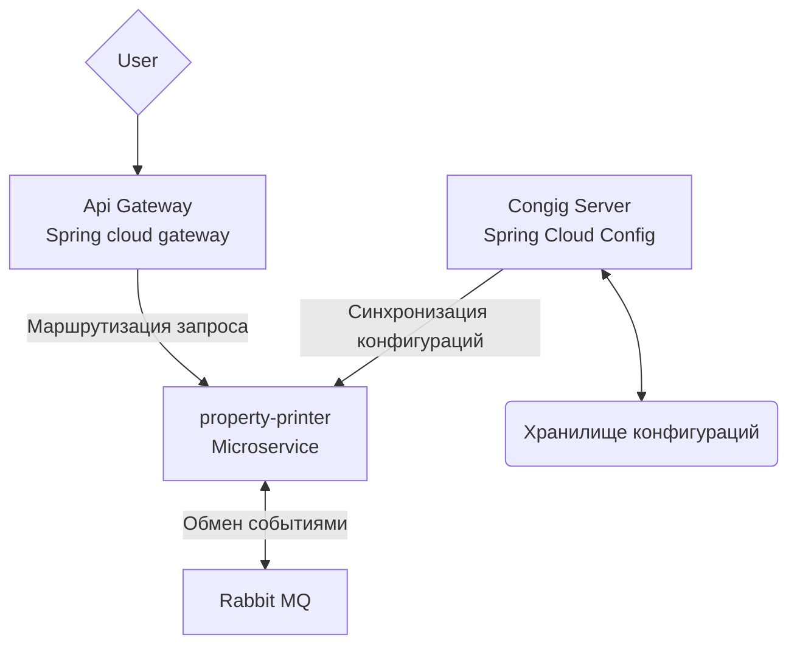

```mermaid
flowchart TD
MQ[Rabbit MQ]
PRINTER[property-printer <br> Microservice]
USER{User}
APIGW[Api Gateway <br> Spring cloud gateway]
CFG[Congig Server<br> Spring Cloud Config]
DB(Хранилище конфигураций)

PRINTER <-- "Обмен событиями" --> MQ
USER  --> APIGW
APIGW -- "Маршрутизация запроса" --> PRINTER
CFG --"Синхронизация конфигураций" --> PRINTER
CFG <--> DB


```